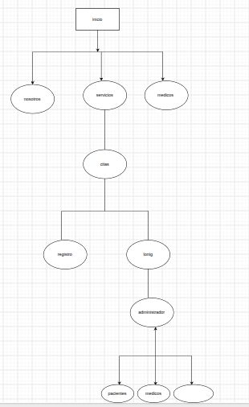
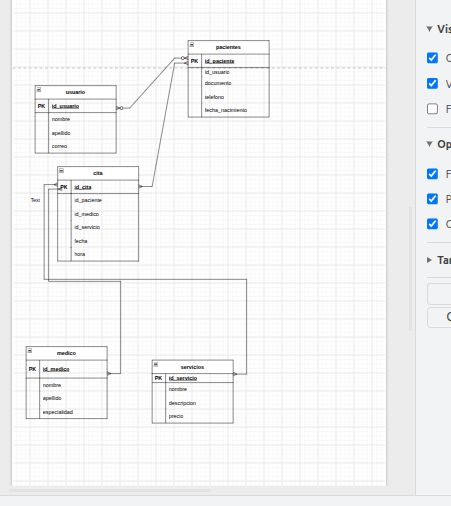
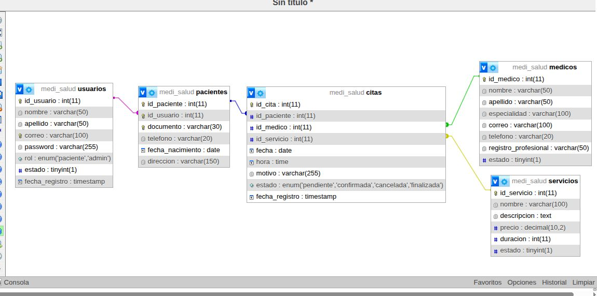
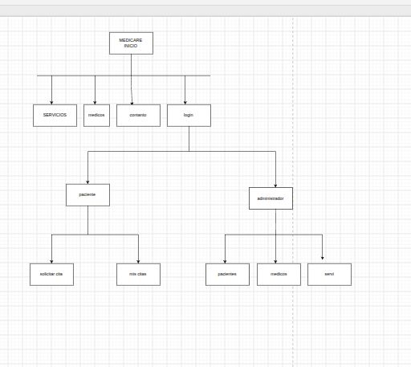

# medi_salud
1. Planteamiento del problema
Problema

Actualmente, muchas personas tienen dificultades para encontrar información clara sobre los servicios médicos disponibles y para solicitar una cita de manera organizada. En algunos centros médicos, las solicitudes de citas todavía pueden depender de llamadas telefónicas, mensajes o procesos manuales.

Para MediCare, esto podría generar dificultades para organizar la información de los pacientes, los médicos disponibles y las citas programadas.

Por esta razón, se propone desarrollar un sitio web que permita a los pacientes consultar los servicios médicos, registrarse, solicitar citas y consultar el estado de sus citas.

Causas

Las principales causas del problema son:

Falta de una plataforma web propia para el centro médico.
Dificultad para consultar los servicios médicos disponibles.
Procesos manuales para solicitar y organizar citas.
Información de médicos y horarios poco centralizada.
Dificultad para que los pacientes consulten sus citas.
Uso de diferentes medios de comunicación para atender las solicitudes.
Consecuencias

Las situaciones anteriores pueden ocasionar:

Pérdida de tiempo para pacientes y personal administrativo.
Dificultad para organizar las citas.
Posibles confusiones con fechas y horarios.
Mayor cantidad de llamadas y mensajes.
Dificultad para consultar rápidamente la información de las citas.
Menor facilidad de acceso a los servicios ofrecidos por el centro médico.
Aporte / solución

El proyecto MediCare propone desarrollar un sitio web responsive que permita a los pacientes conocer los servicios médicos disponibles, consultar información general de los profesionales, registrarse e iniciar sesión y solicitar citas médicas.

El sistema contará con una base de datos MySQL que permitirá almacenar y organizar la información de pacientes, médicos, servicios y citas.

También contará con un usuario administrador que podrá gestionar los servicios, médicos y citas registradas.

De esta manera, el proyecto busca facilitar la interacción entre los pacientes y el centro médico y mejorar la organización de las citas mediante una plataforma web

epicas de usuario:
ÉPICA 1 — Registro y acceso
Historia 1

Como visitante, quiero registrarme en el sitio web para poder solicitar una cita médica.

Historia 2

Como paciente, quiero iniciar sesión para acceder a las funciones disponibles para mi cuenta.

Historia 3

Como paciente, quiero cerrar sesión para proteger mi cuenta.

ÉPICA 2 — Consulta de servicios médicos
Historia 4

Como visitante, quiero consultar los servicios médicos ofrecidos para conocer las especialidades disponibles.

Historia 5

Como visitante, quiero consultar información general de los servicios para elegir el que necesito.

ÉPICA 3 — Médicos
Historia 6

Como visitante, quiero consultar los médicos disponibles para conocer sus especialidades.

Historia 7

Como paciente, quiero seleccionar un médico al solicitar una cita para elegir el profesional que deseo consultar.

ÉPICA 4 — Citas médicas
Historia 8

Como paciente, quiero solicitar una cita médica para recibir atención profesional.

Historia 9

Como paciente, quiero consultar mis citas para conocer las citas que tengo programadas.

Historia 10

Como paciente, quiero conocer el estado de mi cita para saber si está pendiente, confirmada o cancelada.

Historia 11

Como paciente, quiero cancelar una cita para informar que no podré asistir.

ÉPICA 5 — Administración
Historia 12

Como administrador, quiero registrar médicos para mantener actualizada la información de los profesionales.

Historia 13

Como administrador, quiero modificar la información de los médicos para mantenerla actualizada.

Historia 14

Como administrador, quiero registrar servicios médicos para mostrar las especialidades disponibles.

Historia 15

Como administrador, quiero consultar los pacientes registrados para administrar la información básica de los usuarios.

Historia 16

Como administrador, quiero consultar las citas para realizar seguimiento a la agenda del centro médico.

Historia 17

Como administrador, quiero cambiar el estado de una cita para informar al paciente sobre su situación.

